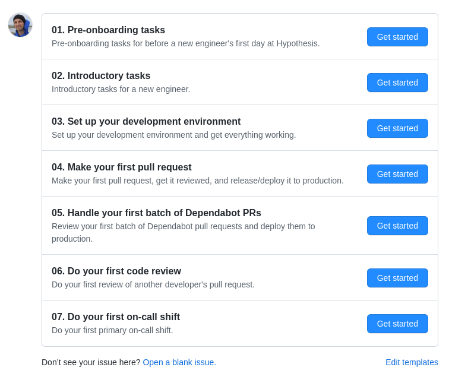
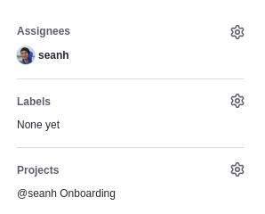

Onboarding
==========

This repo defines the Hypothesis new engineer onboarding process:

* [Issue templates](.github/ISSUE_TEMPLATE) in this repo help to create the
  onboarding issues for each new engineer
* [Project boards](https://github.com/hypothesis/onboarding/projects) in this
  repo keep track of each new engineer's onboarding progress
* [The docs folder](docs) in this repo contains the documentation and guides
  that a new engineer will need: our architecture, core practices, etc
* To report a problem or suggest an improvement to the onboarding process
  [open an issue](https://github.com/hypothesis/onboarding/issues/new) or
  [create a pull request](https://github.com/hypothesis/onboarding/compare)

Creating an onboarding project for a new engineer
-------------------------------------------------

Before a new engineer's first day we need to create a
[GitHub project](https://docs.github.com/en/issues/planning-and-tracking-with-projects)
for their onboarding. To create an onboarding project:

1. [Create a new project](https://github.com/orgs/hypothesis/projects) in the Hypothesis organization.
   Select the **Board** layout for this new project.

2. Give the new project a title/name like **@seanh Onboarding**.

3. Add the new project to this onboarding repo for quick access:
   go to [the onboarding repo's **Projects** tab](https://github.com/hypothesis/onboarding/projects)
   and use the **Add project** button.

4. Create issues in the onboarding repo and add them to the project:

   1. Go to the onboarding repo's [new issue page](https://github.com/hypothesis/onboarding/issues/new/choose)
      and create an issue from one of the templates or use the **Open a blank issue** link:

      

   2. Use the **Assignees** section in the issue's sidebar to assign the issue
      to the new engineer and the **Projects** section to add the issue to the
      onboarding project you created for the new engineer:

      

   3. Repeat until you've finished adding an initial set of issues

### We can vary the onboarding tasks from one new engineer to the next

The idea is to populate each new engineer's project with a sequence of issues
created from the templates provided. We can vary the tasks from one new
engineer to the next:

* You don't have to pre-populate the whole project at the start, you can add more issues later
* You don't have to use all of the issue templates
* You don't have to use the issue templates in the suggested order
* After creating an issue from a template you can edit the issue
* You can use the **Open a blank issue** link to create an issue without using a template

### We can add other issues to an onboarding project

You should also add issues from other repos to an engineer's onboarding project.
The issue templates aren't meant to be all a new engineer does during their
onboarding time. We don't expect them to set up their development environment,
write one PR, review one PR, and then find themselves on-call! The idea is that
they'll also be assigned other tasks during their onboarding time. For example:

* When the new engineer has deployed their first PR they can close their
  _Make your first pull request_ issue.
* They're now capable of making pull requests to fix simple issues, getting
  them approved, and deploying them, so their manager and buddy can help them
  find several more issues to fix with PRs.
* At some point the engineer decides, along with their buddy and manager, that
  they're ready to move on to the next phase of onboarding (say: handling
  Dependabot PRs).
* When they've deployed their first batch of Dependabot PRs the engineer can
  close their _Deploy your first batch of Dependabot PRs_ issue.
* They're now capable of handling Dependabot PRs and can handle their share of
  those from now on.
* And so on
