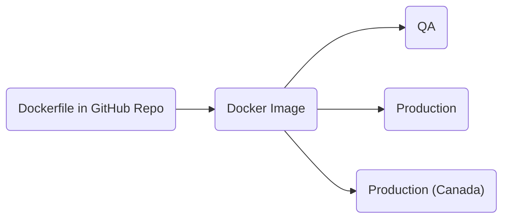
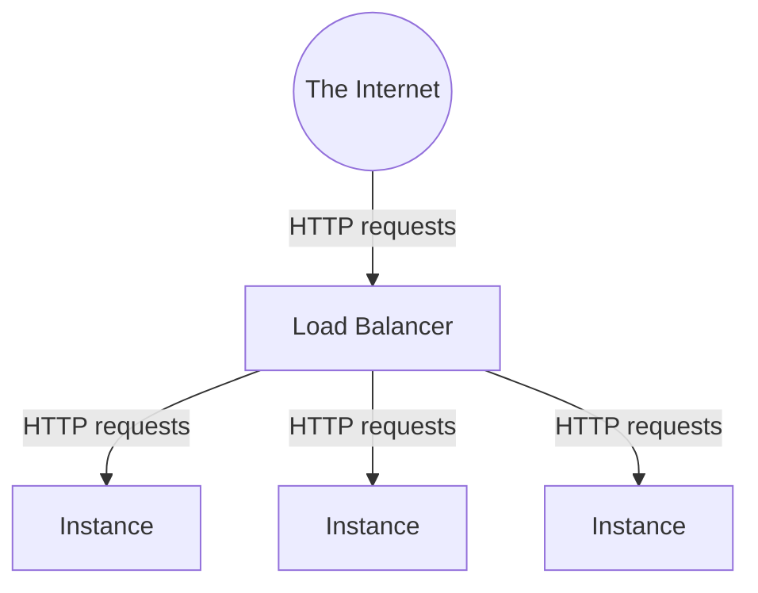
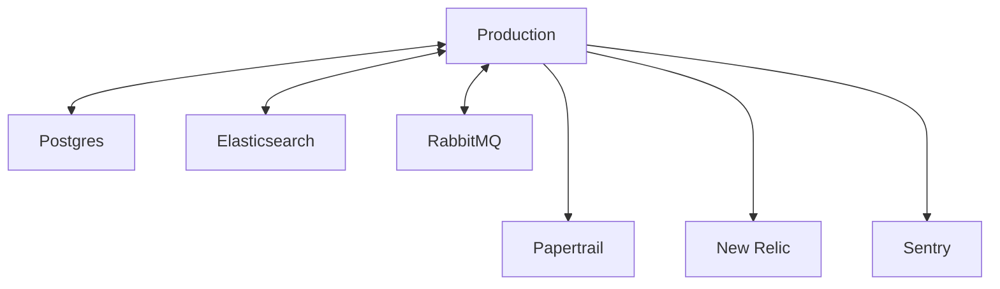
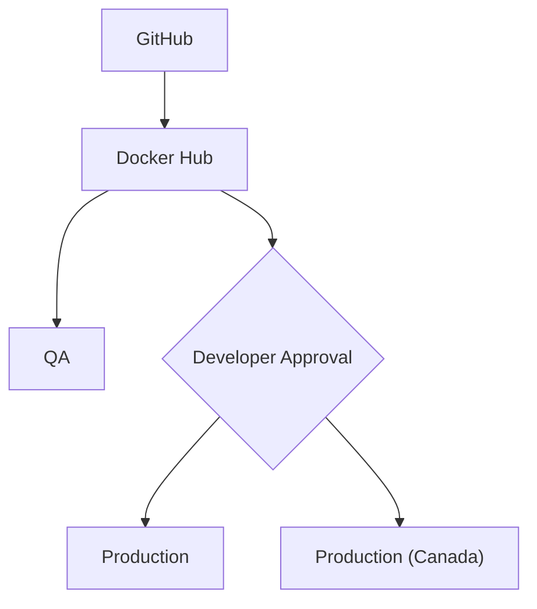

Deploying Your Code to Production
=================================

As soon as you merge a pull request (PR) in an application repo it's
automatically deployed to a QA environment where it's your responsibility to
test it and deploy it to production without delay. Leaving undeployed commits
on QA can slow down the next developer — who might be trying to deploy urgent
changes — as their commits can't be deployed without also deploying yours.

What the QA and production environments look like
-------------------------------------------------

Every Hypothesis application is hosted and deployed in the same way. This
simplifies thinking about operations and deployments and makes tooling easier
to maintain.

Each app has multiple deploys: running instances of the app. For example an app
may be deployed to a **QA** environment, a **Production** environment, and a
**Production (Canada)** environment. The same single Docker image is deployed
to each environment:

Each QA or production environment consists of one or more app servers (called
"instances") behind a load balancer. Each instance is an Amazon EC2 virtual
machine (VM) and the application code runs in Docker containers on these VMs.
The load balancer distributes HTTP requests among instances:

Instances are disposable: deploying a new version of the code destroys all the
instances and replaces them with new VMs. AWS may automatically replace an
instance that appears unhealthy, and also adds and removes instances to scale
the app up and down in response to traffic changes. Each environment's
[auto scaling settings](https://docs.aws.amazon.com/elasticbeanstalk/latest/dg/using-features.managing.as.html)
determine how many instances it has at any given time.

Each environment also has attached backing services like databases, search
indexes, message queues, logging and monitoring services, etc.

These backing services are persistent: they don't get destroyed and replaced by
deployments and autoscaling. Because instances are multiple and disposable any
data that needs to persist must go in a backing service like a database and
not, for example, on the local filesystem.

How code reaches production
---------------------------

When a PR is merged into the `main` branch of a Hypothesis application the
repo's **Deploy** workflow is automatically triggered on GitHub Actions and:

1. Generates a version number from the date and SHA of the Git commit that is being deployed
2. Builds a Docker image from the repo's `Dockerfile` and tags it with the version number
3. Publishes the Docker image to [Hypothesis's Docker Hub account](https://hub.docker.com/u/hypothesis)
4. Calls the Elastic Beanstalk API to trigger a deployment of the new Docker image to the app's QA environment(s)

The developer then tests the code on QA and manually approves the deployment to
production. All deploys to production environments have to be manually
triggered because making changes to production is inherently a risky operation
and [risky business requires active operators](https://medium.com/skylinerhq/risky-business-requires-active-operators-9debbb082995).
Once approved the **Deploy** workflow calls the Elastic Beanstalk API again to
deploy the image to the app's production environment(s).

How Elastic Beanstalk deploys a Docker image to a QA or production environment

To deploy a new Docker image to a QA or production environment Elastic
Beanstalk launches a new batch of instances, deploys the new Docker image to
each of the new instances, checks that the new instances are healthy, attaches
the new instances to the load balancer so that they start serving requests, and
if all looks good finally detaches the old instances from the load balancer and
terminates them. For a brief time instances running the previous and new
versions of the application are both serving requests at once. The exact
details depend on the environment's configured
[deployment policy](https://docs.aws.amazon.com/elasticbeanstalk/latest/dg/using-features.deploy-existing-version.html).

Each app has a **health check endpoint** that must return 200 OK before Elastic
Beanstalk will attach a new instance to the load balancer
(see [How do our `/_status` endpoints work?](https://stackoverflow.com/c/hypothesis/questions/456)).
Before and after new instances are attached to the load balancer Elastic
Beanstalk also uses various other signals (response times, HTTP status codes,
operating system load, CPU usage) to decide whether the instances are healthy
and the deployment has succeeded. See
[Enhanced health reporting and monitoring](https://docs.aws.amazon.com/elasticbeanstalk/latest/dg/health-enhanced.html)
in the Elastic Beanstalk docs for details.

I've merged a PR, how do I deploy it?
-------------------------------------

1. Go to the GitHub repo's **Actions** tab and then go to the **Deploy** workflow
   to see your PR's deployment workflow run in progress.  For example here's
   [h's `deploy.yml` workflow runs](https://github.com/hypothesis/h/actions/workflows/deploy.yml)
   with the most recent run (**Bump pip-tools...**) still in progress:

   

   Click on your worfklow run to see a summary of its progress:

   

2. Your PR is on QA when the **QA / Deploy** job completes successfully:

   

   You should now briefly test your PR on QA. The workflow run's summary page
   shows a handy link to the app's QA environment where you can test it.

   

   
<b>Watch out for other PRs that haven't been deployed yet!</b>

   Sometimes there are previously-merged PRs that haven't been deployed to
   production yet. When you deploy your PR you'll also be deploying these
   previous PRs at the same time. You need to be sure that the previous PRs are
   safe to deploy. You may need to ask the PR's developer on Slack whether
   their PR is safe to deploy, or test it yourself.

   You can see any undeployed PRs on the deploy workflow runs page.
   For example in this screenshot I've just merged
   **Bump sphinx-rtd-theme from 1.0.0 to 1.1.1** and the deployment workflow
   run for that PR is in progress. The three `(!)` icons (indicating cancelled
   workflow runs) show that there are three previously-merged PRs that haven't
   been deployed to production yet:
   **Bump python-slugify from 6.1.2 to 7.0.0**,
   **Bump zope-interface from 5.5.1 to 5.5.2**
   and **Allow RPC messages from LMS when using HTTPS**.
   When I deploy my PR I'll also be deploying those previous three at the same
   time. **Add New Relic to the SQL task runner** is the PR that's currently
   deployed to production.

   
   

3. Once you're satisfied that it's working you should deploy your PR to production.

   On your workflow run's page click the **Review deployments** button, tick
   all the production environments, and click **Approve and deploy**. GitHub
   Actions will now deploy your PR to the app's production environment(s).

   

4. Your PR is on production when the **Production / Deploy** job completes successfully:

   

   You should now briefly test your PR on production and make sure that it's working.
   The workflow run's summary page will show a handy link or links to the app's
   production environment(s).

How do I merge and deploy a batch of PRs all at once?
-----------------------------------------------------

You can merge multiple PRs at once, test them all on QA together, and deploy
them all to production together.

If you merge multiple PRs in succession (_without_ deploying each PR to
production before merging the next) then each subsequently merged PR will
cancel the deploy workflow runs of the previous PRs. For example in this
screenshot I've merged three PRs **Test commit 1**, **Test commit 2** and
**Test commit 3**, the deploy workflow runs for **Test commit 1** and **Test
commit 2** have been automatically cancelled and **Test commit 3** is currently
being deployed to QA:

Once **Test commit 3** finishes deploying to QA I must test all three PRs on QA
then deploy all three to production at once by approving the deployment of
**Test commit 3**.

Help! Someone else merged a PR and it cancelled my workflow run!
----------------------------------------------------------------

Unfortunately if someone else merges another PR while your PR is still being
deployed their PR's deployment workflow run will cancel yours. You can no
longer deploy your PR without deploying the new PR as well. When this happens
you'll have to coordinate with the other developer on Slack: make sure you've
both tested your PRs on QA before deploying both to production at once by
approving the latest PR's workflow run.

How do I redeploy the current version of an app?
------------------------------------------------

Sometimes it's necessary to redeploy the current version of an app, effectively
rebooting the app's servers (actually: terminating the instances and replacing
them with new ones) without upgrading them to a newer version of the code. This
is often used during incidents or outages.

Each app has a **Redeploy** workflow for this purpose: simply navigate to the
app's redeploy workflow runs page, open the **Run workflow** dropdown, tick the
environment(s) that you want to redeploy, and click **Run workflow**:

Note that the redeploy workflow redeploys **the currently running version of
the app** in each environment. Redeploying doesn't necessarily deploy the
latest commit from the `main` branch or the latest image from Docker Hub.
Whatever version is currently deployed to each QA and production environment
will be redeployed to that environment.

What do I do if my deploy fails?
--------------------------------

We aim to make deployments as reliable as possible, but sometimes one might
fail. A failed deployment must be dealt with right away. Failed deployments can
leave different environments or different instances within the same environment
running different versions of the code, which could produce inconsistent and
unpredictable behavior. Also, undeployed commits on `main` can slow down the
next developer — who might be trying to deploy urgent changes — as their
commits can't be deployed without also deploying yours.

You can re-try a failed deployment by clicking the **Re-run failed jobs**
button on the workflow run's summary page.
If your deployment fails repeatedly ask other developers for help in Slack.

What do I do if my deploy breaks something on QA or production?
---------------------------------------------------------------

We use tests and code review to minimize the chances of bugs getting deployed,
but sometimes one might get through and cause problems on QA or production.

There's no "undo button" for deployments. Deploying a newer version of the code
and then replacing it with an older version can create extremely confusing
situations (especially because
[rolling back the code won't roll back external state like caches or databases](https://medium.com/skylinerhq/you-cant-have-a-rollback-button-83e914f420d9)).
Also, if you rolled back the deployment to an older commit but the the
problematic commit remained the latest commit on the `main` branch then the bug
will get redeployed again along with the next developer's PR.

Instead, we always roll forward:

1. Send a PR with a new commit that fixes the issue or even simply reverts the
   problematic commit(s).

   Merged PR pages on GitHub have a **Revert** button that you can use to
   generate a new PR that reverts the merged one:

   

2. Get another developer to review and approve your PR and wait for CI to pass
   as normal. Think about whether deploying the fix might break things even
   more.

3. Merge your new PR and deploy it just like you'd deploy any other PR.

How do I change an environment variable on QA or in production?
---------------------------------------------------------------

You can add, change and remove environment variables in the [Elastic Beanstalk web console](https://console.aws.amazon.com/elasticbeanstalk).
Navigate to the QA or production environment that you want to change then click
**Configuration** (in the left-hand sidebar) then click the **Edit** button
next to **Software** to get to the environment's **Modify software** page.
Scroll down to the **Environment properties** section of this page, which lets
you modify the environment variables. After making the desired changes click
**Apply** and wait for Elastic Beanstalk to finish applying your new
environment variables. This can take time, the console displays an **Elastic
Beanstalk is updating your environment** message while the update is in
progress. For more details see [Configuring environment properties](https://docs.aws.amazon.com/elasticbeanstalk/latest/dg/environments-cfg-softwaresettings.html?icmpid=docs_elasticbeanstalk_console#environments-cfg-softwaresettings-console)
in the Elastic Beanstalk docs.

A couple of things to watch out for when changing environment variables:

* If adding a new required environment variable (i.e. the app will crash or
  misbehave if this environment variable is missing) you need to **add the
  environment variable to each one of the app's environments first** before
  merging any code that depends on the environment variable.

* Some of our apps are deployed to environments in multiple AWS regions, e.g.
  both us-west-1 and ca-central-1 (Canada). Each environment variable needs to
  be set in each environment in each region. The AWS console only shows one
  region at a time. You need to use the regions menu (in the top-right) to
  switch between regions.
